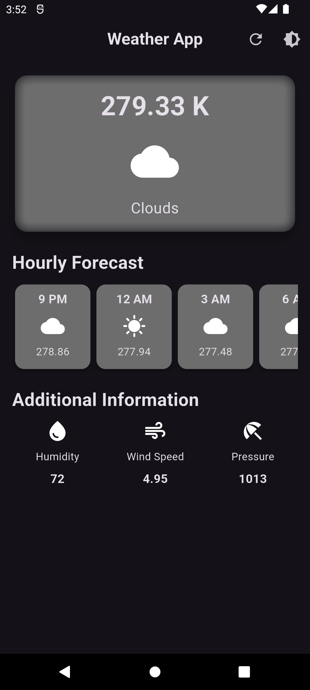
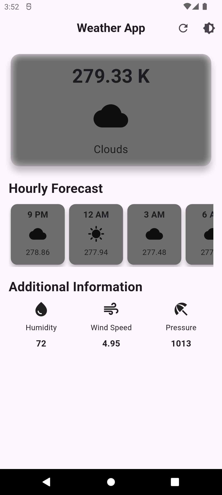

# weather_app

The Weather App is a simple weather forecasting application that displays current weather, hourly forecasts, and additional information such as humidity, wind speed, and pressure. The app supports both light and dark modes, which can be toggled using the theme button in the app bar.

## Getting Started

This project is a starting point for a Flutter application.

A few resources to get you started if this is your first Flutter project:

- [Lab: Write your first Flutter app](https://docs.flutter.dev/get-started/codelab)
- [Cookbook: Useful Flutter samples](https://docs.flutter.dev/cookbook)

For help getting started with Flutter development, view the
[online documentation](https://docs.flutter.dev/), which offers tutorials,
samples, guidance on mobile development, and a full API reference.

## Features

- **Weather data**: Displays current temperature, sky condition, humidity, wind speed, etc.
- **Hourly forecast**: A quick preview of upcoming weather in the next few hours.
- **Light and Dark Mode**: Switch between light and dark themes using the toggle button in the app bar.

## Screenshots

### Dark Mode

### Light Mode
